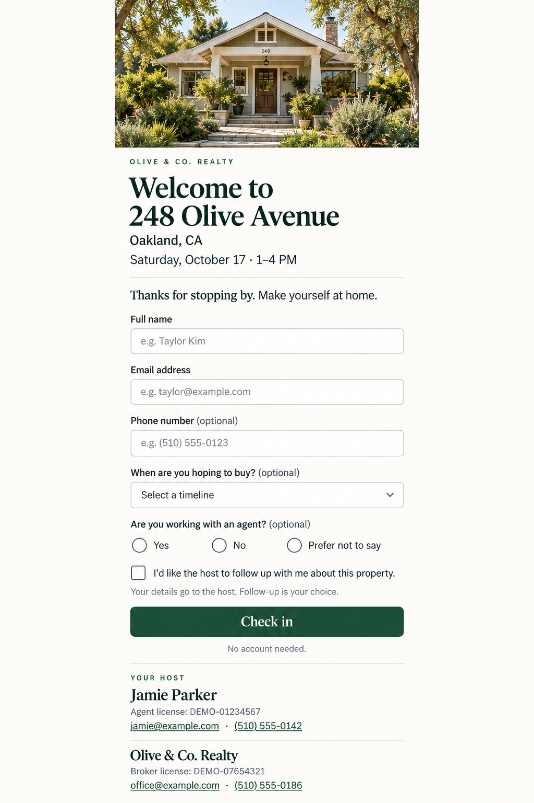

# Open Houseworks · Open-house register

A welcoming check-in page for visitors, and a clear workspace for the host. Built with Rust, Axum, and PostgreSQL. Self-host it, customize it, and keep your visitor data in your own database.

**Development preview.** Local database and browser checks are recorded in commit history; the provider deployment paths still need a fresh-account end-to-end trial before a public template release. This repository is private during preparation, so the public Deploy buttons become usable by other people after publication.



## What it does

- Create and edit open houses; choose draft, open, or closed check-in.
- Give every event its own public `/visit/{id}` page with no visitor account.
- Launch a full-width shared-device kiosk at `/kiosk/{id}`, with portrait and landscape tablet layouts and a fullscreen control.
- Let visitors type on the shared tablet or scan the displayed QR code to check in on their own phone.
- Print a real QR sign pointing to that page.
- Search visitor registrations, export CSV, and permanently delete individual records.
- Customize brokerage name, logo, brand color, welcome message, and privacy notice.
- Optionally show agent name, agent license number, phone, and email; broker name, broker license number, phone, and email. Empty fields disappear from the visitor page.
- Choose whether to ask visitors for a phone number, buying timeline, and agent representation. These answers are optional.
- Record optional follow-up permission, the exact wording presented, and registration time. Permission starts unchecked. The app does not send messages.

One deployment is one host workspace. This version uses a single host password, not a multi-tenant SaaS or a brokerage team-access system. Event availability is controlled by the host; a calendar end time does not automatically close the form. Email addresses are entered by visitors and are not independently verified.

## Run locally

You need Rust 1.94+ and PostgreSQL 16+, or Docker Compose.

```sh
git clone https://github.com/BenBreaksIn/open-house-register.git
cd open-house-register
cp .env.example .env
```

Set `DATABASE_URL`, a unique `ADMIN_PASSWORD` of at least 16 characters, a separate random `SESSION_SECRET` of 32–256 bytes, and `APP_BASE_URL` in `.env`. Generate the secret with `openssl rand -hex 32`; keep it stable and identical on every app instance. Then:

```sh
cargo run --locked
```

Open `http://localhost:3030`. Sign in with the password you configured. Start in **Customize**, then create your first open house. There are no default visitors or fabricated activity counts. The optional sample house photo is AI-generated and labeled illustrative in the host workspace.

### Two ways to check in

Choose **Use this device → Launch kiosk** on the host dashboard to hand over a tablet or computer. This revokes that browser's host session before loading the form and clears other host tabs. Hidden host tabs discard visitor data and recheck access when reopened, including when an edit dialog is open. Unsaved host form fields stay only in memory and are restored after a successful access check; sign-out discards them. Returning to the visitor list requires signing in again. Landscape places the property and QR code beside the form; portrait uses the tablet's width and places the QR option below it. Longer custom text and small viewports can scroll; nothing is clipped to force a fixed-height screen.

Choose **Use their own phone → Share QR code** to display or print a sign. The kiosk also displays that same QR. Both routes save to the same event, but the QR always opens the personal-device page rather than another kiosk. A public deployment and correct `APP_BASE_URL` are needed for scans from other devices; localhost QR codes only work on the host computer.

On the kiosk, submission immediately removes entered details from the screen and resets for the next visitor after eight seconds. **Start over** clears an unfinished form. After 90 seconds without interaction, an unfinished form shows a warning; **I'm still here** extends it, otherwise it clears 30 seconds later. Browser autofill is requested off in kiosk mode, and visitor details are never written to browser storage. Network failures retain the form for retry and do not display a successful check-in.

The fullscreen button enters or exits browser fullscreen where supported. On iPad, Home Screen mode can provide an app-like presentation. Fullscreen is a display feature, not an operating-system lock: use [Apple Guided Access](https://support.apple.com/en-us/111795) or the device's managed kiosk controls when restricting visitors to one app is needed. This web version requires a network connection; it does not queue offline check-ins.

### Docker Compose

Set `ADMIN_PASSWORD`, `SESSION_SECRET`, and a separate `POSTGRES_PASSWORD` in `.env`. For the database password, a long random hexadecimal string avoids connection-URL escaping issues.

```sh
docker compose up --build -d
```

PostgreSQL persists in a Docker volume; it is not exposed on the host. The app binds to localhost port 3030. To expose it publicly, put it behind an HTTPS reverse proxy and set `APP_BASE_URL` to that public origin. Do not discard the database volume unless you intend to remove the registrations.

## Deploy your own

The software is free under MIT. Hosting and database providers have their own plans and costs.

### Vercel

[](https://vercel.com/new/clone?repository-url=https%3A%2F%2Fgithub.com%2FBenBreaksIn%2Fopen-house-register&project-name=open-house-register&repository-name=open-house-register&env=DATABASE_URL%2CADMIN_PASSWORD%2CSESSION_SECRET&envDescription=Set%20a%20PostgreSQL%20URL%2C%20a%20host%20password%20%2816%2B%20characters%29%2C%20and%20a%20separate%20random%20SESSION_SECRET%20%2832%2B%20bytes%29.)

The button clones the project and starts Vercel setup. Connect a PostgreSQL database (for example, through Vercel Marketplace) and provide its `DATABASE_URL`; choose your `ADMIN_PASSWORD` and a separate random `SESSION_SECRET`. Database provisioning is not automated by this button. Use a connection string with TLS enabled for a remote database, and place the database close to the function region.

Vercel's official Rust runtime is currently **beta**. `api/index.rs` adapts the same Axum router used locally to that runtime. No Node backend, frontend build, or persistent local filesystem is required. Assets are embedded in the Rust executable.

`APP_BASE_URL` is optional on Vercel: the app derives the project production URL or deployment URL. Set it explicitly when using a custom domain so QR codes point to the correct public site. The deployment must be publicly accessible for visitors to open check-in links; host routes still require the app's password.

See [Vercel Rust runtime](https://vercel.com/docs/functions/runtimes/rust) and [Deploy buttons](https://vercel.com/docs/deploy-button).

### Render

[](https://render.com/deploy?repo=https://github.com/BenBreaksIn/open-house-register)

The included Blueprint describes a Docker web service and PostgreSQL database, connects them, and generates separate host and session secrets. These are paid compute resources: review the provider's cost summary before deploying. After deployment, retrieve `ADMIN_PASSWORD` from your service's environment settings and use it to sign in. The public origin is derived from `RENDER_EXTERNAL_URL`; set `APP_BASE_URL` if you add a custom domain. Template auto-deployment is off so upstream changes do not automatically alter your running installation.

### Railway or another Docker host

Deploy the `Dockerfile`, attach PostgreSQL, and set `DATABASE_URL`, `ADMIN_PASSWORD`, `SESSION_SECRET`, and your public `APP_BASE_URL`. The server uses `PORT` supplied by the host. A published Railway marketplace template is not included yet.

## Architecture

```text
Visitor / host browser
  HTML + CSS + small JavaScript module
                 │ same-origin JSON requests
                 ▼
            Rust / Axum
   validation · sessions · registration
        QR generation · safe CSV export
                 │ SQLx
                 ▼
            PostgreSQL
   events · visitors · settings · sessions
```

| Location | Responsibility |
|---|---|
| `src/models.rs` | Typed inputs, normalization, and validation |
| `src/api.rs` | Event, registration, settings, QR, and export handlers |
| `src/auth.rs`, `src/client_ip.rs` | Host sign-in, sessions, trusted client identification, and request protection |
| `src/db.rs`, `migrations/` | PostgreSQL connections and versioned schema |
| `src/lib.rs` | Shared router, embedded assets, and response headers |
| `src/main.rs` | Conventional HTTP server |
| `api/index.rs` | Vercel runtime adapter |
| `web/app.js` | Shared forms, host workspace, and personal-device registration |
| `web/kiosk.js`, `web/kiosk-view.js`, `web/kiosk.css` | Shared-device lifecycle, fullscreen controls, and responsive tablet layout |
| `design/` | Imagegen design references, not screenshots of a deployed service |

The database schema is migrated at process startup. Sessions are random, stored as token hashes, and expire after 24 hours. A domain-separated HMAC keyed by `SESSION_SECRET` associates sessions with the current host password without storing a fast password verifier in the database. Changing either secret invalidates sessions. The security migration clears existing sessions, so upgrading hosts must sign in again; registrations are preserved. Authentication uses an HttpOnly SameSite cookie; HTTPS origins use Secure cookies. Writes require the app's custom request header and the server does not enable cross-origin requests. Public endpoints never return visitor records. SQL is parameterized; CSV cells are escaped for both CSV syntax and spreadsheet formulas.

Rate limits live in PostgreSQL, so they work across instances: 10 sign-in attempts and 30 check-ins per minute per client IP (IPv6 uses a /64). Higher deployment-wide ceilings are 600 sign-in attempts and 3,000 valid check-ins per minute; a client already over its own limit cannot spend this shared allowance. Devices behind one public address share a client budget. Client keys are HMACs; raw IP addresses are not stored in the rate-limit table. Expired buckets are removed during rate checks. Repeated registration with the same event/email does not overwrite the first record or its consent. Hosts can delete a record before a visitor registers again with updated details.

Registration storage is capped at 1,000 records per event and 10,000 per deployment by default. Configure `MAX_VISITORS_PER_EVENT` and `MAX_VISITORS_TOTAL` (1–1,000,000) to fit your installation. A database transaction lock prevents concurrent requests across instances from exceeding these caps. Duplicates remain idempotent at capacity. The dashboard shows capacity; hosts can export and delete records to free space. All instances must use the same limits.

The dashboard shows up to the most recent 10,000 registrations. Event CSV exports stream in batches of at most 200 rows through both the conventional server and Vercel adapter; the entire export is never buffered. Exports are a live view: concurrent deletion can remove rows during download. Large installations should add pagination and retention controls before adopting this starter. Configure database backups and your retention process in your host environment. Displaying license fields is not a determination that local brokerage disclosure requirements have been met.

### Client addresses behind a proxy

Direct/self-hosted mode uses the socket peer and ignores client-supplied forwarding headers. For your own HTTPS reverse proxy, set `TRUSTED_PROXY_CIDRS` to **only its actual source addresses/networks** and have it overwrite or append the connecting client address to `X-Forwarded-For`. The app walks that chain from the trusted peer toward the first untrusted address. Restrict the app origin to that proxy. Do not use `0.0.0.0/0`, `::/0`, or a network containing untrusted clients. Leaving proxy trust unset safely shares one budget across the proxy's clients, so configure this before public use.

With provider environment flags, Vercel uses `x-vercel-forwarded-for`; Render uses Cloudflare's `CF-Connecting-IP`. These modes require provider ingress to be the only public route. Missing or malformed provider headers fail the request instead of putting every client in one anonymous bucket. See [Vercel request headers](https://vercel.com/docs/headers/request-headers), [Render's Cloudflare ingress](https://render.com/articles/how-render-handles-ddos-attacks), and [Cloudflare origin headers](https://developers.cloudflare.com/fundamentals/reference/http-headers/). Verify two independent client addresses and spoofed-header rejection in your actual provider deployment before release; local tests do not establish provider behavior. Other Docker hosts require an explicit, verified proxy configuration.

## Checks

```sh
cargo fmt --check
cargo clippy --locked --all-targets -- -D warnings
cargo test --locked
TEST_DATABASE_URL=postgres://localhost/houseworks_test \
  cargo test --locked --tests -- --ignored
cargo build --locked --release --bins
node --check web/app.js
```

The database integration tests are intentionally ignored unless explicitly requested with a separate test database. They exercise authentication, kiosk session revocation, optional brokerage fields, draft/open/closed access, QR generation, saved registration, duplicate consent protection, honeypot handling, private export, CSV formula escaping, and logout. Security regressions also cover spoofed forwarding headers, independent client limits, IPv6 address rotation, concurrent capacity enforcement, session-secret/password rotation, upgrade cleanup, and multi-batch CSV completeness. Both integration suites are enabled in CI. Never point `TEST_DATABASE_URL` at a live visitor database.

Browser checks cover tablet portrait/landscape layouts, fullscreen entry/exit, actual registration, automatic reset, abandoned-form warning/extension/reset, and a failed network request with retryable input. Timer checks use a controlled browser clock. Browser viewport checks do not establish physical iPad/Safari acceptance.

## Contributing

Keep the visitor flow short, provide accessible controls, avoid adding a service that isn't necessary, and keep Rust domain behavior separate from browser presentation. Include a focused test for changes to access control, persistence, or registration behavior. Do not commit `.env`, visitor data, browser session state, or database files.

## License

[MIT](LICENSE). The design mockups and sample property image were generated with the built-in imagegen tool for this project. The names, contact details, license numbers, and activity in the mockups are fictional examples.
